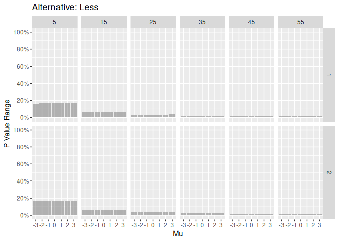
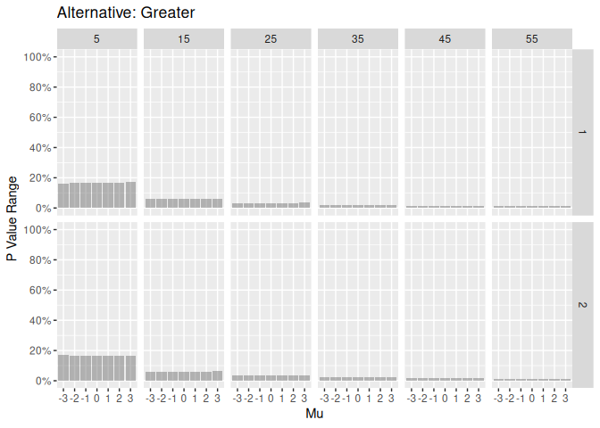
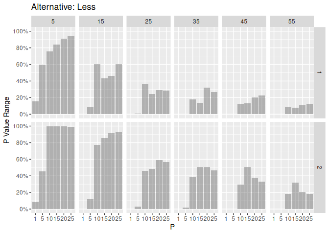

# Bayesian Overview

Under the Bayesian paradigm, probability is one of two things:

- A long running proportion. (1)
- A measurement of personal belief. (2)

Further, the Bayesian does not have to pick. At any point, the Bayesian
is free to pick the definition that is convenient and then change the
selection later.

For the second definition, the key work is **personal belief**. Given 10
Bayesians, it is realistic 10 different priors would be selected for a
single experiment. Which prior is best? Under the Bayesian view point,
all are equally valid because prior distributions quantify **personal
belief**. The first Bayesian is under no requirement to have the same
opinion as the other 9 Bayesians.

Considering prior distributions affect posterior distributions which
affect p value calculations, there would be 10 different p values for
the same experiment. Each Bayesian arrives at a unique p value due to
their individual prior selection.

# What are driving factor’s for selecting prior distributions?

Short answer: Personal belief.

Long answer: There are many factors that influence prior selection: A
few decision rules include:

- [conjugate](https://en.wikipedia.org/wiki/Conjugate_prior) where the
  priors are chosen so that the posterior distribution is in the same
  family as the prior distribution.
- [emprical
  priors](https://en.wikipedia.org/wiki/Empirical_Bayes_method) where
  the prior distribution’s parameters are selected based on data.
- [hierarchical
  prior](https://en.wikipedia.org/wiki/Bayesian_hierarchical_modeling)
  where the prior distribution’s parameters are given prior
  distributions.
- [uninformative
  priors](https://en.wikipedia.org/wiki/Prior_probability#Uninformative_priors)
  where priors are chosen so that personal belief is minimized.

# Simulation Overview

In this repo, four different hypothesis tests are considered.

1.  Test $\mu$ when X is a Gaussian random variable.
    - A Gaussian prior for the unknown mean.
    - A gamma prior for the unknown variance.
2.  Test $\sigma^2$ when X is a Gaussian random variable.
    - A Gaussian prior for the unknown mean.
    - A gamma prior for the unknown variance.
3.  Test $\lambda$ when X is a Poisson random variable.
    - A gamma prior for $\lambda$.
4.  Test p when X is a Bernoulli random variable.
    - A beta prior for p.

The main question answered is “While controlling data, what is the range
of p values possible if only the prior is changing?”

# Results

In the following graphs, there are 6 total sample sizes (5, 15, 25, 35,
45, 55) and two seeds (1 and 2) used for creating two random samples.
Within a panel, only the parameters are changing. Within each column of
a panel, only the prior’s parameters are changing. The posterior’s
parameter is the the x-axis.

P value range interpretations:

- A value of 0 means prior’s parameters have no effect on p value
  calculations. All p values are the exact same.
- A value of 1 means any p value is possible by simply changing the
  personal belief and the prior’s parameters.

### Testing the mean of a Gaussian random variable.

As sample size increases, the prior’s parameters don’t have much affect.
For N equal to 5, the prior selection is a major factor.

### Testing the variance of a Gaussian random variable.

The p values are not sensitive to selection of the prior distribution’s
parameters when testing the variance.

### Testing lambda of a Poisson random variable.

For this test, the range of p values drastically increased. Even for a
sample size of 55, the range stays large. Different data sets have
different ranges.

### Testing p of a Bernoulli random variable.

Similar to the Poisson test, the range of p values is very large. Even
for a sample size of 55, the range stays large. Different data sets have
different ranges.

### Main Take Aways

- For tests about a Gaussian random variable, changes in the conjugate
  prior did not have major affects of p value calculations.
- For tests about a Poisson random variable, the prior distribution had
  a great deal of influence.
- For tests about a Bernoulli random variable, the prior distribution
  had a great deal of influence as well.
- The amount of influence changes from random sample to random sample.
